# Hi there! 👋 I'm Kankshi Shah

<div align="center">
  
[](https://git.io/typing-svg)

</div>

<div align="center">
  
</div>

---

## 🌟 About Me


🎓 **Currently pursuing B.Tech in Computer Engineering** at Sardar Patel Institute of Technology  
🏆 **State-level Hackathon Winner** with multiple 24-hour coding sprints under my belt  
💡 Passionate about **Artificial Intelligence, IoT, Web & Mobile Development**  
🌱 **Currently mastering:** Data Structures & Algorithms, Advanced Frontend, Machine Learning  
🎯 **2025 Goals:** Contribute to open source, build impactful AI projects, land dream internship  
⚡ **Fun fact:** Did you know the first computer bug was an actual bug? A moth stuck in a relay! 🦋  

### 🎨 When I'm Not Coding
- 🎶 **Music Lover** - Electronic & Instrumental beats fuel my coding sessions
- 💃 **Classical Dancer** - 8 years of Bharatnatyam (discipline meets creativity!)
- 🧩 **Problem Solver** - Love tackling complex algorithms and design challenges

---

## 🛠️ Tech Arsenal

<div align="center">

### 💻 Programming Languages


### 🎨 Frontend Development


### 🔧 Tools & Technologies


</div>

---

## 🚀 Featured Projects

<div align="center">

| Project | Description | Tech Stack |
|---------|-------------|------------|
| 🛡️ **NirBhaya** | IoT-based women's safety wearable with real-time alerts | IoT, C++, Sensors |
| 🚗 **DriveSafe** | AI-powered driving behavior analysis for safer roads | Python, ML, Flutter |
| 💰 **Spend Savvy** | Smart expense tracking with analytics | Flask, MySQL, JS |
| 🌍 **Better World** | Platform connecting volunteers with social causes | Flask, Bootstrap |
| ❓ **Quiz-A-Thon** | Interactive quiz platform with timer & lifelines | C, Data Structures |

</div>

---

## 🏆 Achievements & Recognition

<table align="center">
  <tr>
    <td align="center" width="50%">
      
      <br><br>
      <strong>Ranked 1st in Diploma</strong><br>
      Computer Engineering<br>
      <em>Outstanding Academic Performance</em>
    </td>
    <td align="center" width="50%">
      
      <br><br>
      <strong>State-Level Winner</strong><br>
      24-Hour Coding Marathon<br>
      <em>Innovation Under Pressure</em>
    </td>
  </tr>
  <tr>
    <td align="center">
      
      <br><br>
      <strong>President of Enigma '24</strong><br>
      Event Management & Leadership<br>
      <em>Leading Technical Community</em>
    </td>
    <td align="center">
      
      <br><br>
      <strong>Hackathon Enthusiast</strong><br>
      Rapid Solution Development<br>
      <em>Building Under Time Constraints</em>
    </td>
  </tr>
</table>

---

## 📊 GitHub Analytics

<div align="center">
  
</div>

<div align="center">
  
</div>

---

## 🎯 Current Focus

```mermaid
graph TD
    A[🎯 2025 Goals] --> B[🤖 AI/ML Projects]
    A --> C[🌐 Open Source Contributions]
    A --> D[💼 Dream Internship]
    A --> E[🏆 Advanced Certifications]
    
    B --> F[Computer Vision]
    B --> G[NLP Applications]
    C --> H[GitHub Community]
    C --> I[Tech for Good Projects]
```

<div align="center">



</div>

---

## 🎨 Coding Activity

<div align="center">
  
```text
🌅 Morning    ██░░░░░░░░░░░░░░░░░░░░    5%
🌆 Daytime    ██████░░░░░░░░░░░░░░░░   25%
🌃 Evening    ██████░░░░░░░░░░░░░░░░   24%
🌙 Night      ███████████░░░░░░░░░░░   46%
```

</div>

---

## 🌐 Let's Connect!

<div align="center">

[](https://www.linkedin.com/in/kankshi-shah-76539a258/)
[](mailto:shahkankshi@gmail.com)
[](https://x.com/kshah_1986)
[](https://kankshi19.github.io/my-portfolio/)
[](https://www.hackerrank.com)

</div>

---

## 💝 Support My Journey

<div align="center">

If you find my projects helpful or interesting, consider giving them a ⭐️!  
*Every star motivates me to build something even better* 🚀

[](https://github.com/kankshi19)
[](https://github.com/kankshi19)

</div>

<div align="center">
  
**💭 "Code is like humor. When you have to explain it, it's bad." – Cory House**


</div>
<div align="center">
   
  <em><b>Happy coding!</em>
</div>
